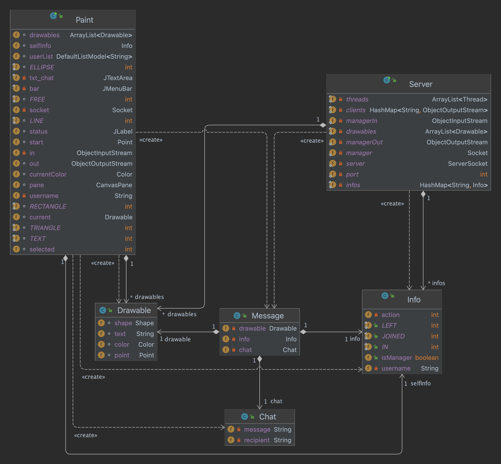

# System Architecture

The system consist of a centralised server to serve between manager and clients and manage connections to the shared whiteboard.
On start, the server will wait for the first client to connect, and the client becomes manager of the whiteboard. All clients connect later will require additional approval before joining the shared whiteboard, which we will discuss later in communication protocols.
Apart from maintaining client connections, the server also holds all shapes drawn by all clients. This will be shared to newly joined clients once approved by the manager.

# Communication Protocol
Every client connecting to the server will first send a `String` containing its user name to server. If this is the first client, the server will reply an `Info` indicating the client is manager and enable manager related features on client side. If not, the server will send an `Info` to manager for approval. Manager will reply with modified `Info` that indicates if this client is approved. If yes, the server will send all previous `Drawable` to this client and start accepting its message, otherwise the server will inform the client and close connection. When collaborating on the shared whiteboard, every client will either send `Drawable` or `Chat` to the server, the server will then broadcast the message to all approved clients. On leave, the client will send an `Info` to server, the server will broadcast the message to all other clients to notify, then close the connection. If the leaving client is manager, then all other clients will close the connection as well. Additionally, the manager can kick out clients from the whiteboard by sending `Info` with this client's username. The server will broadcast the message to all clients and close the corresponding connection. The manager can also create a new whiteboard, the server will broadcast the message to all clients.

Communication flow of manager join, using whiteboard, kick out user and leave

Communication flow of client join, using whiteboard and kicked out by manager

# Message Formats
The server and clients communicate by sending `Serializable` objects to each other. For each message, it contains one object of the following classes: `Drawable`, `Info`, and `Chat`.

# Design Diagram

